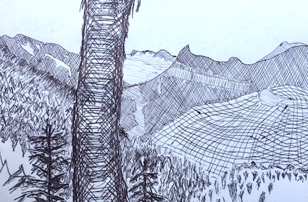

# Project plan

## The idea 

Replace this text with a description of the drawing you want to make. (It would be nice to also explain why you want to make this drawing.) It's helpful, but not required, to include a sketch of what you are planning. If you want to add an image, you can do so like this: 

## Decomposition

Again, replace this text with an explanation of how you plan to decompose the project into smaller parts. This should include a list of the functions you think you will write, and how they will fit together. Again, sketches are helpful but not required.

## Milestones

- **Milestone 0**: What will be finished when you are 1/3 done with the project?
- **Milestone 1**: What will be finished when you are 2/3 done with the project?
